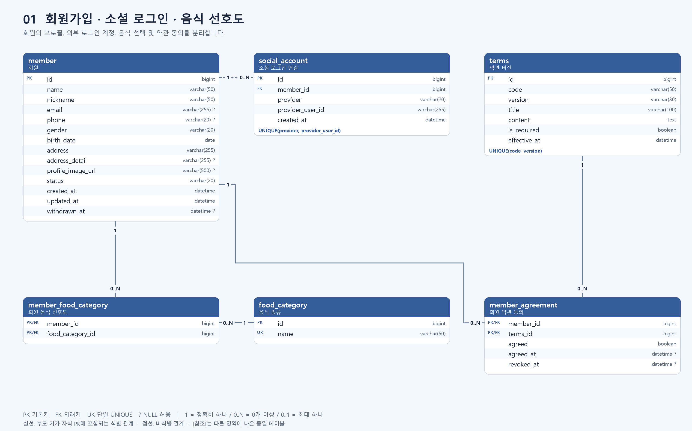
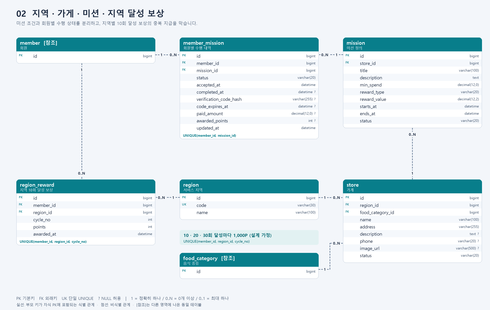
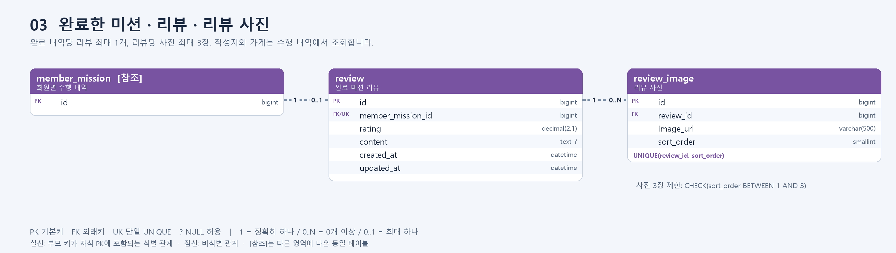

# 지역 방문 미션 리워드 서비스 ERD 설계

## 1. 설계 목적과 분석 자료

지역에 속한 가게에서 미션을 수행하고, 미션 보상과 지역별 달성 보상을 받는 서비스를 설계했다. 미션의 공통 조건과 회원별 수행 내역을 분리하여 여러 회원이 같은 미션에 참여할 수 있도록 했다.

분석 자료는 저장소에 제공된 [IA](../for_UMC.png)와 [와이어프레임](../for_UMC%20%281%29.png), 과제의 필수 요구사항이다. 지도·검색, 내 포인트 관리 화면, 알림 설정, 사장님 점포 관리 화면은 제외했다. 1:1 문의·도움말·온보딩 배너도 핵심 범위에 포함하지 않았다. 리뷰 작성은 IA와 미션 완료 화면에 있어 포함했다.

### 화면에서 확인한 내용과 테이블 매핑

| 화면 / 기능 | 필요한 데이터 | 설계 테이블 |
|---|---|---|
| 소셜 로그인 | 카카오·네이버·애플·구글 계정과 회원 연결 | `member`, `social_account` |
| 회원가입 | 이름, 성별, 생년월일, 주소 | `member` |
| 서비스 이용 동의 | 필수/선택 약관과 버전별 동의 여부 | `terms`, `member_agreement` |
| 음식 선호 조사 | 여러 음식 종류 선택 | `food_category`, `member_food_category` |
| 홈 | 선택 지역, 지역 완료 진척도, 도전 가능한 미션 | `region`, `store`, `mission`, `member_mission` |
| 가게 정보 | 가게명·주소·대표 사진·음식 종류·리뷰 | `store`, `food_category`, `review`, `review_image` |
| 미션 도전 | 결제 조건, 남은 기간, 보상 | `mission`, `member_mission` |
| 진행 중 / 완료 미션 | 회원별 상태와 완료 시각 | `member_mission` |
| 성공 요청 / 인증번호 | 인증 요청 상태, 번호 유효기간 | `member_mission` |
| 미션 성공 | 정액 또는 비율 보상 확정 | `mission`, `member_mission.awarded_points` |
| 지역별 10개 완료 | 1,000P 지급과 중복 지급 방지 | `region_reward` |
| 리뷰 작성 | 별점·본문·사진(화면의 0/3 표시) | `review`, `review_image` |

### 화면만으로 확정할 수 없어 정한 정책

1. **지역별로 누적 10개마다 1,000P를 반복 지급한다.** 서로 다른 지역의 완료 수는 합산하지 않는다. 1회 한정 지급이 의도라면 `cycle_no`를 제거하고 `(member_id, region_id)`만 UNIQUE로 바꾸면 된다.
2. 회원은 **동일 미션을 한 번만 완료**한다. 취소 후 재도전은 기존 수행 행을 재사용하며, 매 방문 반복 미션은 별도 `mission`으로 등록한다. 재도전 이력 자체는 이번 범위에서 보관하지 않는다.
3. 가게는 서비스 지역 1개, 대표 음식 카테고리 1개에 속한다. 회원은 여러 음식을 선호할 수 있다. 선호 선택은 최대 3개로 가정하고 서버에서 검증한다.
4. 화면의 정액 포인트와 `5% 적립`을 함께 지원한다. 비율 보상은 인증된 결제 금액을 기준으로 계산하고 소수점 이하는 버린다. 지역 달성 보상 1,000P와 개별 미션 보상은 별도다.
5. 리뷰는 완료한 수행 내역당 최대 1개, 사진은 최대 3장이다. 별점은 0.5~5.0의 0.5 단위이며, 본문 없이 별점만 작성할 수 있다고 가정한다.
6. 과거 완료 수의 지역 및 보상 조건이 바뀌지 않도록, 참여 내역이 생긴 미션의 가게·조건·기간과 해당 가게의 지역은 변경하지 않는다. 변경이 필요하면 새 미션 또는 새 가게 레코드를 만든다.

## 2. ERD 이미지

전체 13개 테이블을 세 영역으로 나누었다. `[참조]`는 다른 영역의 **동일 테이블을 다시 표시한 것**이며 별도 테이블이 아니다. 각 영역을 합친 [전체 PNG](reward-service-erd.png)도 제공한다.

### 회원가입·소셜 로그인·선호도

### 지역·가게·미션·보상

### 완료 미션·리뷰

`PK`는 기본키, `FK`는 외래키, `UK`는 단일 컬럼의 유일키다. 복합 UNIQUE는 각 테이블 아래에 별도로 표기했다. `?`는 NULL 허용을 의미한다. 관계선의 `1`, `0..N`, `0..1`은 각각 정확히 하나, 0개 이상, 0개 또는 하나를 뜻한다. 실선은 부모 키가 자식 PK에 포함되는 식별 관계이고, 점선은 비식별 관계다. **점선이라고 FK가 NULL을 허용하는 것은 아니다.**

## 3. 테이블별 설계 이유

| 테이블 | 역할과 분리 이유 |
|---|---|
| `member` | 회원의 프로필과 상태를 저장한다. 소셜 계정과 분리하여 인증 제공자에 독립적인 회원 식별자를 둔다. |
| `social_account` | 소셜 제공자와 외부 사용자 ID를 저장한다. `(provider, provider_user_id)`를 UNIQUE로 지정하여 하나의 소셜 계정이 여러 회원에 연결되지 않도록 한다. |
| `food_category` | 한식·일식 등의 공통 카테고리를 관리한다. 선호도와 가게 분류에서 같은 기준을 사용한다. |
| `member_food_category` | 회원과 음식 종류의 N:M 관계를 연결한다. 음식 이름을 쉼표로 묶어 회원 컬럼에 저장하지 않는다. |
| `terms` | 약관 종류별 버전·내용·필수 여부를 보관한다. 내용을 변경할 때 기존 행을 덮어쓰지 않고 새 버전을 만든다. |
| `member_agreement` | 어떤 회원이 어떤 약관 버전에 동의했는지 저장한다. 전체 동의 버튼은 여러 약관을 한꺼번에 선택하는 UI이므로 별도 테이블로 만들지 않는다. |
| `region` | 미션 탐색 및 10회 달성 집계 단위다. 이름이 같은 지역을 구분할 수 있도록 고유 코드를 둔다. |
| `store` | 지역과 대표 음식 카테고리에 속한 가게 정보다. 점주 계정이나 점포 관리 화면 데이터는 추가하지 않았다. |
| `mission` | 가게별 도전 조건·기간·보상 규칙을 저장한다. 여러 회원이 공유하는 미션 정의다. |
| `member_mission` | 누가 어떤 미션에 도전했으며 현재 어떤 상태인지 기록한다. 완료 당시 확정한 포인트도 저장한다. |
| `region_reward` | 회원·지역·달성 회차별 보너스 지급 기록이다. 포인트 사용/환전 관리가 아니라 서비스 핵심 지급 규칙을 위한 최소 기록이다. |
| `review` | 완료한 수행 내역을 FK로 참조한다. 작성자·가게를 중복 저장하지 않아 다른 회원 또는 다른 가게로 연결되는 불일치를 줄인다. |
| `review_image` | 리뷰의 여러 사진과 표시 순서를 저장한다. 사진 URL을 `image1`, `image2`, `image3` 컬럼으로 나누지 않는다. |

모든 컬럼의 타입, NULL 허용 여부, 키와 설명은 [테이블 상세 정의](schema.md)에 정리했다. 수정 가능한 [Mermaid 원본](reward-service.mmd)도 포함한다. PNG와 상세 정의는 `render_erd.py`의 동일 테이블 정의로 생성한다.

## 4. 주요 관계

| 부모 → 자식 | 관계 | 의미 |
|---|---|---|
| member → social_account | 1 : 0..N | 회원은 여러 소셜 계정을 연결할 수 있다. 가입 완료 시 최소 1개 연결은 서비스 로직에서 보장한다. |
| member → member_food_category | 1 : 0..N | 회원은 여러 음식 종류를 선택한다. |
| food_category → member_food_category | 1 : 0..N | 같은 음식 종류를 여러 회원이 선택할 수 있다. |
| member → member_agreement | 1 : 0..N | 회원은 여러 약관에 각각 동의한다. |
| terms → member_agreement | 1 : 0..N | 같은 약관 버전에 여러 회원이 응답한다. |
| region → store | 1 : 0..N | 하나의 지역에는 여러 가게가 있다. |
| food_category → store | 1 : 0..N | 하나의 음식 종류에 여러 가게가 속한다. |
| store → mission | 1 : 0..N | 가게는 여러 미션을 제공한다. |
| member → member_mission | 1 : 0..N | 회원은 여러 미션에 도전한다. |
| mission → member_mission | 1 : 0..N | 같은 미션에 여러 회원이 도전한다. |
| member → region_reward | 1 : 0..N | 회원은 지역·회차별 보상을 받는다. |
| region → region_reward | 1 : 0..N | 같은 지역에서도 회원마다 별도로 보상을 받는다. |
| member_mission → review | 1 : 0..1 | 완료 내역당 리뷰는 최대 1개이며 작성하지 않아도 된다. |
| review → review_image | 1 : 0..N | 리뷰 사진은 선택 사항이며 추가 제약으로 최대 3장이다. |

`member`와 `mission`의 N:M 관계는 `member_mission`으로, `member`와 `food_category`의 N:M 관계는 `member_food_category`로 해소했다. 모든 자식 행의 FK는 NOT NULL이며 부모 행 하나를 반드시 참조한다.

## 5. 상태와 정합성 규칙

### 가입과 로그인

- 소셜 로그인 식별에는 이메일 대신 `(provider, provider_user_id)`를 사용한다. 이메일은 없거나 제공자별로 다를 수 있으므로 회원 병합 기준으로 사용하지 않는다.
- 소셜 로그인 전용으로 가정했으므로 비밀번호 컬럼을 만들지 않았다. 소셜 액세스 토큰·리프레시 토큰도 이번 ERD에는 영구 저장하지 않는다.
- 회원, 소셜 연결, 선호도, 약관 동의는 가입 트랜잭션으로 저장한다. 필수 약관 동의, 가입 나이, 선호 선택 수는 서버에서 검증한다.
- `member_agreement`의 복합 PK는 같은 버전에 대한 중복 행을 막는다. 현재 동의 상태를 관리하는 설계이며, 철회·재동의의 모든 변경 이력이 필요하면 별도 이벤트 테이블을 추가한다.

### 미션 수행

기본 흐름은 `IN_PROGRESS → PENDING → COMPLETED`이다. 도전 취소는 `CANCELLED`, 기간 만료는 `EXPIRED`로 처리한다. 인증 실패나 인증번호 만료 후 미션 기간이 남아 있으면 `IN_PROGRESS`로 되돌려 성공 요청을 다시 할 수 있다. `CANCELLED → IN_PROGRESS` 재도전은 기간 내에만 허용하며 기존 인증 정보는 초기화한다. 완료 상태는 종결 상태다.

| 검증 위치 | 규칙 |
|---|---|
| DB PK/FK/UNIQUE | 존재하지 않는 회원·가게·미션 참조, 동일 미션 중복 참여, 중복 지역 보상, 중복 리뷰를 방지한다. |
| DB CHECK | 상태값 허용 목록, `starts_at < ends_at`, 금액·포인트 음수 금지, `cycle_no >= 1`, `points = 1000`을 검증한다. |
| DB CHECK | `reward_type = FIXED`이면 보상값은 0 이상의 정수, `RATE`이면 0~100 범위로 제한한다. |
| DB CHECK | `COMPLETED`이면 `completed_at`, `paid_amount`, `awarded_points`가 모두 존재하고, 미완료 상태에서는 `completed_at`과 `awarded_points`가 NULL이어야 한다. |
| DB CHECK | 리뷰 별점 범위·0.5 단위, 사진 순서 1~3을 제한한다. 사진의 `(review_id, sort_order)` UNIQUE와 함께 최대 3장을 보장한다. |
| 서버 / 트랜잭션 | 활성 가게·활성 미션인지, 현재 시각이 `[starts_at, ends_at)`에 속하는지, 결제 금액이 최소 조건을 충족하는지 검증한다. |
| 서버 / 트랜잭션 | 인증번호는 `PENDING` 상태에서만 유효하며 만료·시도 횟수 제한과 일회성 사용을 적용한다. 성공 시 인증 정보를 폐기한다. |
| 서버 / 트랜잭션 | 본인의 완료 내역인지 확인한 후에만 리뷰를 등록한다. FK만으로 '완료 상태'까지 검증할 수는 없다. |

짧은 숫자 인증번호는 단순 해시만으로 안전해지지 않는다. 비밀키를 사용하는 검증값이나 별도 인증 저장소를 사용하고, 시도 횟수 제한은 임시 저장소에서 관리한다. 이번 설계는 인증 결과를 받는 데 필요한 데이터만 포함하며 점주 관리 화면은 만들지 않는다.

### 미션 보상 계산

- 정액: `awarded_points = reward_value`.
- 비율: `awarded_points = FLOOR(paid_amount × reward_value / 100)`.
- 예: 최소 12,000원 미션에서 12,500원 결제를 인증하고 보상률이 5%라면 625P를 확정한다.
- 이 값은 완료 트랜잭션에서 저장한다. 나중에 규칙이 변경되어도 과거 지급액을 다시 계산하지 않는다.

## 6. 지역별 10개 완료 시 1,000P 지급

특정 회원과 지역의 완료 수 `C`는 `member_mission → mission → store`를 JOIN하여 `member_id`, `store.region_id`, `member_mission.status = COMPLETED`로 집계한다. 회원·미션 조합이 UNIQUE이므로 같은 미션은 한 번만 센다.

`FLOOR(C / 10)`까지의 각 회차에 대해 지급 기록을 만든다. 현재 홈 진행도는 `C % 10`이며, 10번째 완료 직후에는 달성 연출을 보여주고 다음 회차 진행도를 0으로 표시한다고 가정한다. 와이어프레임의 `7/10`은 진행 바 표시값으로 계산하므로 DB에 별도 저장하지 않는다.

| 회원 | 지역 | 누적 완료 수 | 지급 대상 회차 | 누적 지역 보너스 |
|---|---|---:|---|---:|
| A | 안암동 | 7 | 없음 | 0P |
| A | 안암동 | 10 | 1회차 | 1,000P |
| A | 안암동 | 20 | 1·2회차 | 2,000P |
| A | 다른 지역 | 9 | 없음 | 0P |
| B | 안암동 | 10 | B의 1회차 | 1,000P |

완료와 지급은 반드시 하나의 트랜잭션에서 처리한다.

1. 해당 `member` 행을 먼저 잠근다. 동일 회원의 모든 완료 처리 경로가 이 순서를 따르게 하여 동시 요청을 직렬화한다.
2. `member_mission`을 잠그고 이미 완료되었는지 확인한다. 이미 완료된 요청은 기존 결과를 반환한다.
3. 인증·기간·결제 조건을 확인하고 `COMPLETED`, 완료 시각, 확정 포인트를 기록한다.
4. 잠금 획득 이후 최신 커밋 데이터를 볼 수 있는 격리 수준/조회 방식으로 해당 지역의 완료 수를 집계한다. 예를 들어 READ COMMITTED 트랜잭션을 사용할 수 있다.
5. `1 .. FLOOR(C / 10)` 중 아직 없는 회차의 `region_reward`에 1,000P를 기록하고 함께 커밋한다.

`UNIQUE(member_id, region_id, cycle_no)`는 같은 회차의 중복 지급을 막는 최종 방어선이다. UNIQUE만으로 집계 시점의 동시성 문제가 해결되는 것은 아니므로 위 잠금·트랜잭션 규칙도 함께 적용한다.

포인트 사용·차감이 없는 현재 범위의 **누적 획득 포인트**는 완료 내역의 `awarded_points` 합과 지역 보상의 `points` 합을 각각 계산한 뒤 더한다. 두 테이블을 바로 다대다 JOIN하여 합산하면 금액이 중복될 수 있으므로 각각 먼저 집계한다. 이는 사용 가능한 잔액 모델이 아니며, 환전·사용 기능을 추가할 때에는 별도 포인트 원장이 필요하다.

## 7. 조회·운영 시 유의사항

- 홈의 도전 가능한 목록은 선택 지역의 활성 미션 중 해당 회원이 아직 도전하지 않았거나 취소한 미션을 조회한다. 진행 중·완료 목록은 `member_mission.status`로 나눈다. 남은 기간 D-day는 `ends_at`에서 계산한다.
- 리뷰 작성자: `review → member_mission → member`. 리뷰 가게: `review → member_mission → mission → store`. 가게 평균 별점·리뷰 수는 리뷰에서 계산한다.
- 음식 추천은 `member_food_category`와 가게의 대표 카테고리로 필터링할 수 있다. 추천 알고리즘 자체는 설계 범위 밖이다.
- 권장 조회 인덱스: `store(region_id)`, `store(food_category_id)`, `mission(store_id, status, ends_at)`, `member_mission(member_id, status, completed_at)`, `member_mission(mission_id)`, `social_account(member_id)`, `member_food_category(food_category_id)`, `member_agreement(terms_id)`, `region_reward(region_id)`. UNIQUE/PK로 이미 지원하는 접근에는 중복 인덱스를 추가하지 않는다.
- 완료 이력을 가진 미션·가게는 삭제 대신 비활성화한다. 원본 데이터 삭제가 지급 집계에 영향을 주지 않도록 FK는 기본적으로 RESTRICT로 둔다. 리뷰 삭제 시에는 그 리뷰 사진을 함께 삭제할 수 있다.
- 회원 탈퇴는 상태로 표시하되, 개인정보 삭제·익명화와 데이터 보존 정책은 서비스 구현 시 별도로 정해야 한다. 단순 상태 변경만으로 개인정보 처리가 완료되는 것은 아니다.

## 8. 제출용 설명 요약

> 본 ERD는 지역별 가게 방문 미션을 수행하는 리워드 서비스를 13개 테이블로 설계한 것이다. `member`와 `social_account`를 분리하여 소셜 제공자별 로그인 정보를 관리하고, `member_food_category`로 회원과 음식 종류의 다대다 관계를 표현했다. `region → store → mission`으로 지역별 미션을 구성하며, `member_mission`에 회원별 도전 상태와 완료 내역을 저장한다. 회원·지역별 누적 완료 수가 10개씩 증가할 때마다 `region_reward`에 1,000P 지급 기록을 생성하고, 회원·지역·회차의 복합 UNIQUE로 중복 지급을 방지한다. 리뷰는 완료한 수행 내역과 연결하여 실제 미션 수행자가 작성하도록 설계했다. 지도·검색·알림·점주 관리 및 포인트 사용/환전은 제외했으며, 화면에서 확정할 수 없는 반복 지급 등은 설계 가정으로 명시했다.

## 파일 구성

- `reward-service-erd.png`: 세 영역을 합친 제출용 전체 이미지.
- `01-members.png`, `02-missions.png`, `03-reviews.png`: 확대해서 볼 수 있는 영역별 이미지.
- `schema.md`: 컬럼별 데이터 사전.
- `reward-service.mmd`: 수정 가능한 Mermaid ERD 원본. 복합 UNIQUE와 범위 제약은 본 문서·데이터 사전 참고.
- `render_erd.py`: 이미지·데이터 사전·Mermaid 생성 코드(Pillow 필요).

이 결과물은 **논리 ERD 설계안**이며, 실행용 SQL이나 구현된 백엔드가 아니다. DB 적용 시 FK·UNIQUE·CHECK·인덱스를 DDL로 옮기고 위 서비스 검증 규칙을 구현해야 한다.
